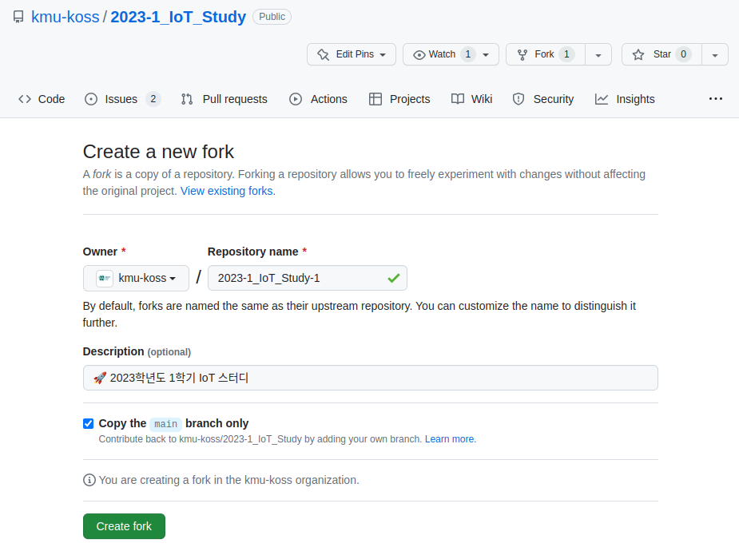
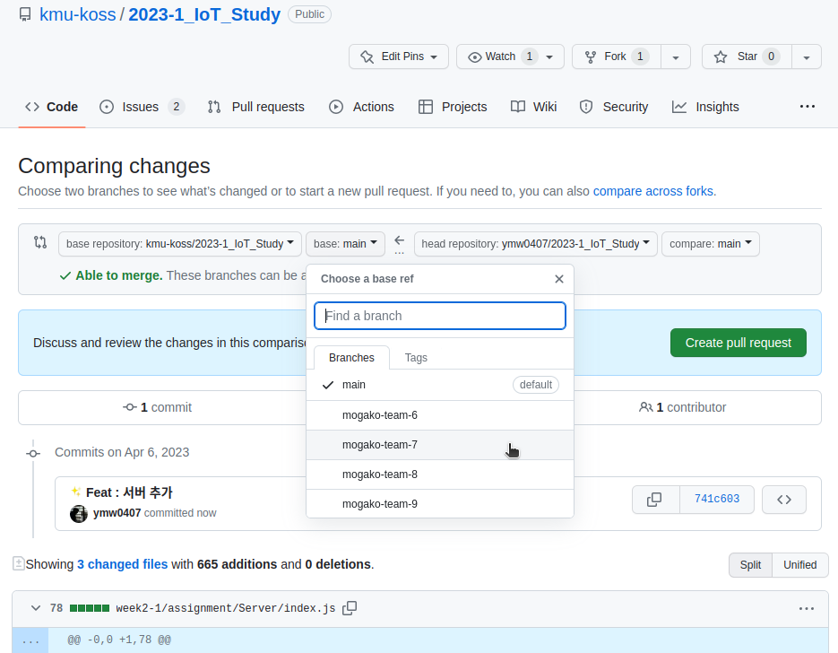
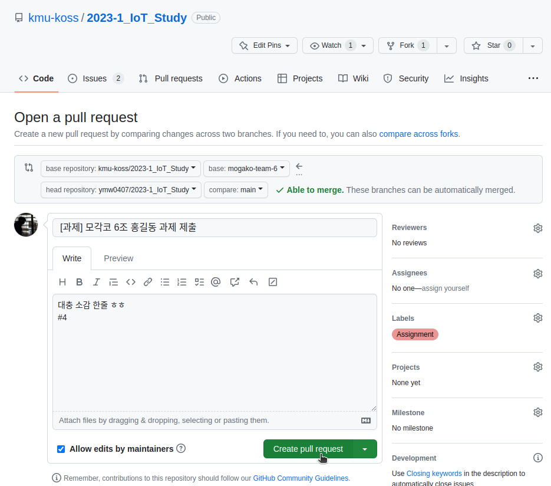
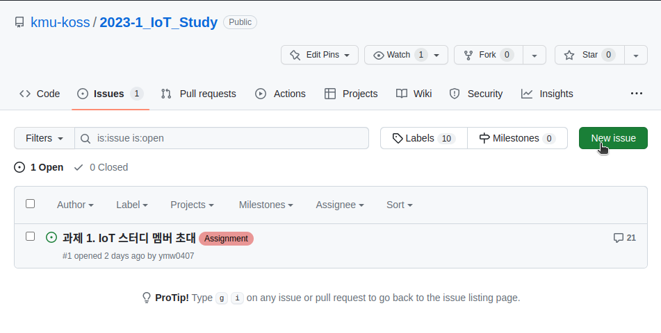
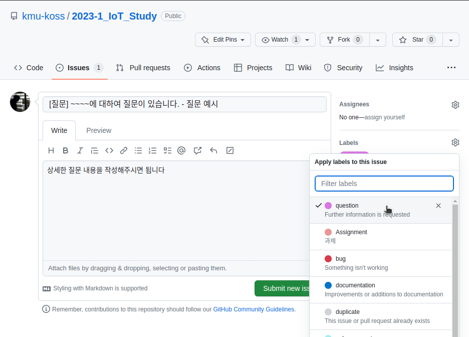
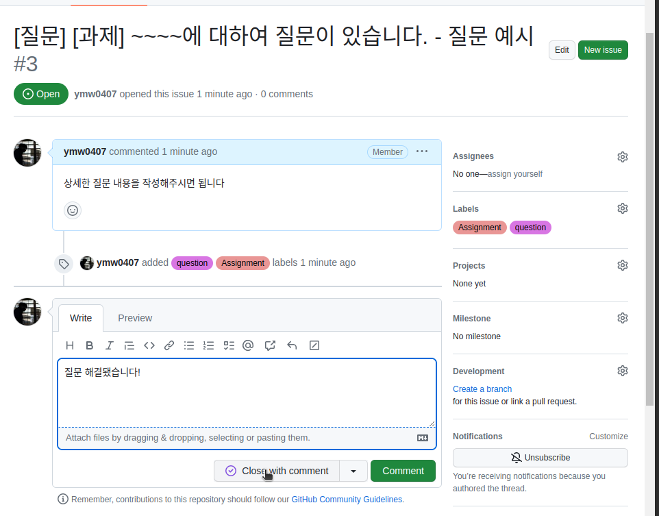

# KOSS 2023학년도 1학기 IoT 스터디
국민대학교 소프트웨어융합대학 OpenSource Software 학술동아리 KOSS의 2023학년도 1학기 IoT 스터디입니다.

## 스터디 진도
스터디는 4월 4일부터 1학기 동안 진행됩니다.  
스터디는 멘토들의 수업을 통해서 이뤄질 예정입니다.  
중간고사 이후(5월부터) IoT 스터디와 CV 스터디는 분리되어 진행됩니다.  

### 1주차
- 날짜 : 2023-04-04 18:30 ~ 21:00
- 장소 : 국민대학교 미래관 445호
- 주제 : `1. Server - JavaScript에 대한 이해`
- 강의 자료 : <a href="./week1"> 링크 </a>
- 과제 제출 : <a href="https://github.com/kmu-koss/2023-1_IoT_Study/issues/1"> 링크 </a> 

### 2주차
- 날짜 : 2023-04-11 18:30 ~ 21:00
- 장소 : 국민대학교 미래관 445호
- 주제 : `2. Embedded System - Raspberry Pi & MQTT Protocol(1)`
- 강의 자료 : <a href="./week2-2"> 링크 </a>
- 과제 제출 : <a href="https://github.com/kmu-koss/2023-1_IoT_Study/issues/10"> 링크 </a>

### 3주차
- 중간고사

### 4주차
- 날짜 : 2023-05-04 18:30 ~ 21:00
- 장소 : 국민대학교 미래관 445호
- 주제 : `3. Server & DB & Frontend 연동`

## 모각코 진도
모각코에서는 모각코 조끼리 모여서 자료들을 보면서 공부하며, 과제를 수행하는 방식으로 스터디와 함께 병행됩니다.

### 1주차
- 각자 조끼리 만나서 모각코 미션을 수행(친해지는 시간)

### 2주차
- 날짜 : 2023-04-06 18:30 ~ 21:00
- 장소 : 국민대학교 미래관 445호
- 주제 : `1. Server - Node.js와 EXPRESS.JS 입문`
- 강의 자료 : <a href="./week2-1"> 링크 </a>
- 과제 제출 : <a href="https://github.com/https://github.com/kmu-koss/2023-1_IoT_Study.gitkmu-koss/2023-1_IoT_Study/issues/4"> 링크 </a> 

### 3주차
- 날짜 : 2023-04-13 18:30 ~ 21:00
- 장소 : 국민대학교 미래관 445호
- 주제 : `2. Embedded System - Raspberry Pi & MQTT Protocol(2)`
- 강의 자료 : <a href="./week2-2"> 링크 </a>
- 과제 제출 : <a href="https://github.com/kmu-koss/2023-1_IoT_Study/issues/10"> 링크 </a>

---

## 과제 제출 - GitHub

### 과제 제출 방법
과제를 제출할 때에는 다음과 같이 제출합니다.
1. 해당 Repository를 Fork합니다.

2. 과제를 완성하고, 자신의 모각코 조의 Branch에 Pull Requset를 건다.

3. 단, Pull Request를 걸때, #1과 같이 과제 번호와 연결한다.

---

### 온라인 질문 방법
스터디 시간 이외에 하고 싶은 질문이 있다면 Issue를 통하여 질문을 올려주시면 됩니다!  
그리고 이런 방법을 사용하는 이유는 OpenSource Software에 기여할 때나 프로젝트를 진행할때 GitHub를 사용할텐데, GitHub의 기능을 좀 더 원활하게 하기 위함입니다.

### GitHub Issue 질문 포맷
1. 해당 Repository의 <a href="https://github.com/kmu-koss/2023-1_IoT_Study/issues">Issues 카테고리</a>에서 New Issue 버튼을 누른다. 

2. 제목은 `[질문][과제] Express와 MongoDB를 연결하는 부분에 대해서 질문이 있습니다.`와 같은 포맷을 사용하여 올려주세요!

3. Write에는 보다 상세하게 어떤 부분에 문제가 있고, 어떤게 궁금한지 남겨주세요!

4. 아래의 사진과 같이 Labels에 question와 Assginment(과제에 대한 질문이라면.)를 추가하여 올려주세요! 

5. 그 이후에 멘토가 확인하고 해당 이슈에 comment를 달아드립니다.

6. 만약 문제가 해결됐으면, `질문 해결됐습니다`와 같은 comment와 함께 close with comment 버튼을 눌러주시면 됩니다. 

---

## IoT 스터디 멤버 및 대회팀

### 임베디드SW 경진대회 webOS 부문 - OOO 팀
<table>
  <tr>
  <td align="center"><a href="https://github.com/hwna00"> <b>하철환</b></a> <a href="https://github.com/hwna00" title="Code">👑</a></td>
    <td align="center"><a href="https://github.com/1004jaein"> <b>김재인</b></a> <a href="https://github.com/1004jaein" title="Code">💻</a></td>
    <td align="center"><a href="https://github.com/seojinhyeong99"> <b>서진형</b></a> <a href="https://github.com/seojinhyeong99" title="Code">💻</a></td>
    <td align="center"><a href="https://github.com/Muon05"> <b>송보경</b></a> <a href="https://github.com/Muon05" title="Code">💻</a></td>
    <td align="center"><a href="https://github.com/yangjiwoong1"> <b>양지웅</b></a> <a href="https://github.com/yangjiwoong1" title="Code">💻</a></td>
  </tr>
</table>

### 임베디드SW 경진대회 자동차/모빌리티 부문 - OOO 팀
<table>
  <tr>
  <td align="center"><a href="https://github.com/hsw1805"> <b>홍세원</b></a> <a href="https://github.com/hsw1805" title="Code">👑</a></td>
    <td align="center"><a href="https://github.com/jhj04"> <b>정현주</b></a> <a href="https://github.com/jhj04" title="Code">💻</a></td>
    <td align="center"><a href="https://github.com/inqueue0979"> <b>조원재</b></a> <a href="https://github.com/inqueue0979" title="Code">💻</a></td>
    <td align="center"><a href="https://github.com/always-spring01"> <b>조항범</b></a> <a href="https://github.com/always-spring01" title="Code">💻</a></td>
    <td align="center"><a href="https://github.com/jisw0822"> <b>지성은</b></a> <a href="https://github.com/jisw0822" title="Code">💻</a></td>
  </tr>
</table>